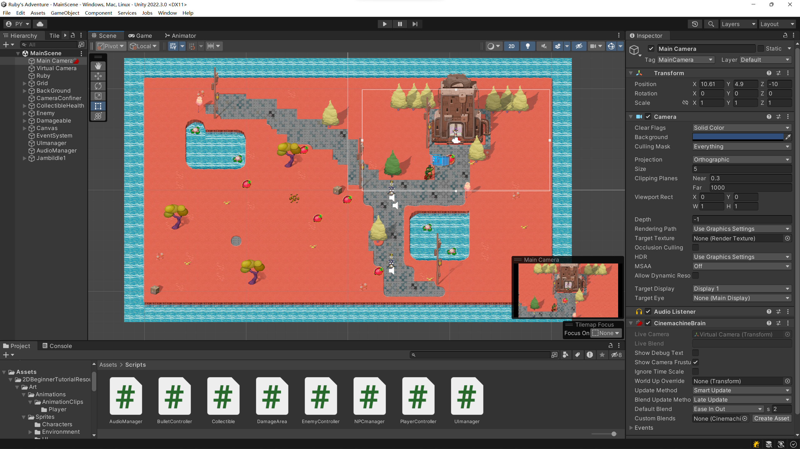
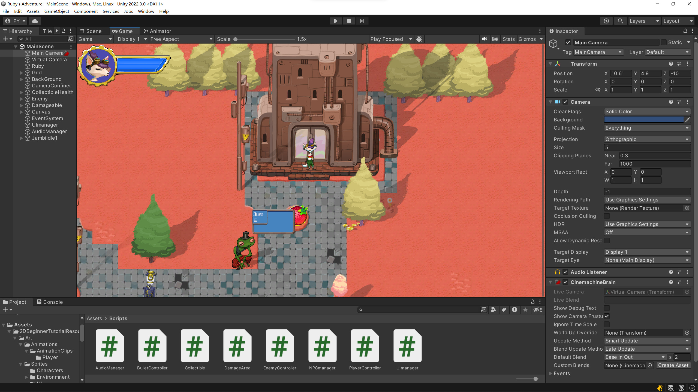

# Ruby's Adventure

[Ruby's Adventure](https://learn.unity.com/project/ruby-s-adventure-2d-chu-xue-zhe)

# 游戏截图





# 总结

## Get started with Ruby’s Adventure

- **Unity 编辑器**基本操作
  - 操纵对象
  - **Layouts**

- Unity Asset Store

## Get started with Ruby’s Adventure

## Character Controller and Keyboard Input

- Use the **Unity Input System**, which is composed of **Input Settings** and **input code**
  - **Input Settings**：**Edit > Project Settings**
  - Handled **keyboard input** through axes

```csharp
   void Update()
   {
       float horizontal = Input.GetAxis("Horizontal");
       float vertical = Input.GetAxis("Vertical");
       Vector2 position = transform.position;
       position.x = position.x + 3.0f * horizontal * Time.deltaTime;
       position.y = position.y + 3.0f * vertical * Time.deltaTime;
       transform.position = position;
   }
```

## World Design - Tilemaps

## Decorating the World

## World Interactions - Blocking Movement

## World Interactions - Collectibles

## World Interactions - Damage Zones and Enemies

## Sprite Animation

## World Interactions - Projectile

## Camera - Cinemachine

## Visual Styling - Particles

## Visual Styling - User Interface - Head-Up Display

## World Interactions - Dialog Raycast

## Audio

- Audio Clips, Audio Source and Audio Listener

## Build, Run, Distribute

- Player Settings

import Assets, write scripts, use the physics system, use tile maps, create particle effects and add audio.